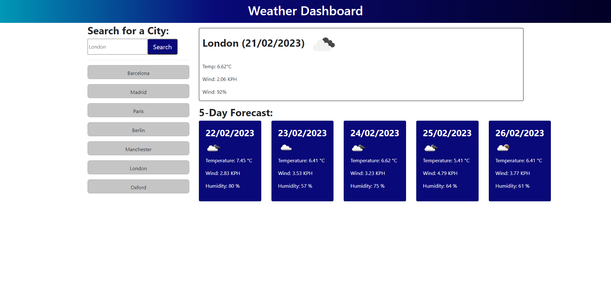

# Weather 5-Day Forecast

## Description

This is a simple web application that allows you to search for the current weather and 5-day forecast of a specific location.

## Features

- Current weather information: The app displays the current temperature, wind speed, and humidity for the searched location.
- 5-day forecast: The app displays a 5-day forecast with the date, weather icon, temperature, wind speed, and humidity for each day.
- Search history: The app keeps a record of your search history and allows you to easily search for previous locations.
- Local storage: The app saves your search history to your browser's local storage, so your search history will persist even if you close the app or refresh the page.

## Usage

Follow the [link](https://willguille.github.io/weather-dashboard/)

To use the app, simply enter the name of a city in the search input field and click the "Search" button. The app will display the current weather information and a 5-day forecast for the location you searched for.

You can also view your search history by clicking on the "History" button. Your search history will be saved to your browser's local storage, so it will persist even if you close the app or refresh the page.

To search for a city from your search history, simply click on the name of the city in the search history list and the app will display the weather and forecast for that location.

## License

Please refer to the LICENSE in the repo.